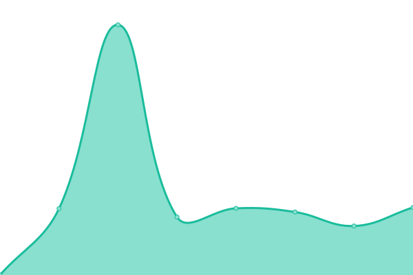

# [📈 Live Status](https://broo37.github.io/upptime): <!--live status--> **🟧 Partial outage**

This repository contains the open-source uptime monitor and status page for [Iwan Kurniawan](https://broo37.github.io/upptime), powered by [Upptime](https://github.com/upptime/upptime).

With [Upptime](https://upptime.js.org), you can get your own unlimited and free uptime monitor and status page, powered entirely by a GitHub repository. We use [Issues](https://github.com/broo37/upptime/issues) as incident reports, [Actions](https://github.com/broo37/upptime/actions) as uptime monitors, and [Pages](https://broo37.github.io/upptime) for the status page.

<!--start: status pages-->
<!-- This summary is generated by Upptime (https://github.com/upptime/upptime) -->
<!-- Do not edit this manually, your changes will be overwritten -->
<!-- prettier-ignore -->
| URL | Status | History | Response Time | Uptime |
| --- | ------ | ------- | ------------- | ------ |
|  [Google](https://www.google.com) | 🟩 Up | [google.yml](https://github.com/Broo37/upptime/commits/HEAD/history/google.yml) | 

 70ms
     
 | 

<a href="https://Broo37.github.io/upptime/history/google">100.00%</a>
    

|  [Geisa API](https://api.geisaforce.com) | 🟥 Down | [geisa-api.yml](https://github.com/Broo37/upptime/commits/HEAD/history/geisa-api.yml) | 

 743ms
     
 | 

<a href="https://Broo37.github.io/upptime/history/geisa-api">0.00%</a>
    

|  [Geisa TA API - Dev](https://dev-ta.geisaforce.com/api/Health/IsUp) | 🟥 Down | [geisa-ta-api-dev.yml](https://github.com/Broo37/upptime/commits/HEAD/history/geisa-ta-api-dev.yml) | 

 9588ms
     
 | 

<a href="https://Broo37.github.io/upptime/history/geisa-ta-api-dev">0.00%</a>
    

<!--end: status pages-->

[**Visit our status website →**](https://broo37.github.io/upptime)

## 📄 License

- Powered by: [Upptime](https://github.com/upptime/upptime)
- Code: [MIT](./LICENSE) © [Anand Chowdhary](https://anandchowdhary.com), supported by [Pabio](https://pabio.com)
- Data in the `./history` directory: [Open Database License](https://opendatacommons.org/licenses/odbl/1-0/)
